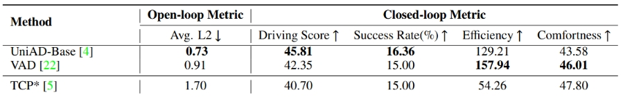
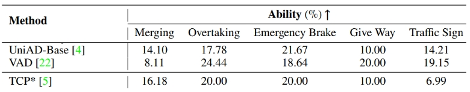

# Comparison among End-to-End Self Driving Solutions using Bench2Drive
This repo is for ROB 530 Final Project

Abstract: This project aims to construct three established end-to-end self-driving systems and test their performance on the NuScenes dataset. Through analyzing the results qualitatively and quantitatively, the strengths and limitations of each model can be furthered declared.

## Model traning
The three end-to-end methods in this project, including TCP, UniAD and VAD are implemented based on their original repo, specifically, [TCP](https://github.com/OpenDriveLab/TCP), [UniAD](https://github.com/OpenDriveLab/UniAD) and [VAD](https://github.com/hustvl/VAD). 

You can setup each algorithm and train the model basing on the dataset provided in their repo.

## Benchmark evalution
The benchmark used in this project is [Bench2Drive](https://github.com/Thinklab-SJTU/Bench2Drive). In order to evaluate your trained model, your agent should be linked to Bench2Drive. 

## Setup
  - Download and setup CARLA 0.9.15
    ```bash
        mkdir carla
        cd carla
        wget https://carla-releases.s3.us-east-005.backblazeb2.com/Linux/CARLA_0.9.15.tar.gz
        tar -xvf CARLA_0.9.15.tar.gz
        cd Import && wget https://carla-releases.s3.us-east-005.backblazeb2.com/Linux/AdditionalMaps_0.9.15.tar.gz
        cd .. && bash ImportAssets.sh
        export CARLA_ROOT=YOUR_CARLA_PATH
        echo "$CARLA_ROOT/PythonAPI/carla/dist/carla-0.9.15-py3.7-linux-x86_64.egg" >> YOUR_CONDA_PATH/envs/YOUR_CONDA_ENV_NAME/lib/python3.7/site-packages/carla.pth # python 3.8 also works well, please set YOUR_CONDA_PATH and YOUR_CONDA_ENV_NAME
    ```

## Eval Tools
  - Add your agent to leaderboard/team_code/your_agent.py & Link your model folder under the Bench2Drive directory.
    ```bash
        Bench2Drive\ 
          assets\
          docs\
          leaderboard\
            team_code\
              --> Please add your agent HEAR
          scenario_runner\
          tools\
          --> Please link your model folder HEAR
    ```

## Results

The three models' evaluation result in Bench2Drive is shown below. 

### OPEN-LOOP AND CLOSED-LOOP RESULTS [5]


### MULTI-ABILITY RESULTS [5]


## Reference:
1. P. Wu, X. Jia, L. Chen, J. Yan, H. Li, and Y. Qiao, “Trajectory-guided control prediction for end-to-end autonomous driving: A simple yet strong baseline,” 2022. [Online]. Available:https://arxiv.org/abs/2212.02181
2.  Y. Hu, J. Yang, L. Chen, K. Li, C. Sima, X. Zhu, S. Chai, S. Du, T. Lin, W. Wang, L. Lu, X. Jia, Q. Liu, J. Dai, Y. Qiao, and H. Li, “Planning-oriented autonomous driving,” 2023. [Online]. Available: https://arxiv.org/abs/2212.10156
3. B. Jiang, S. Chen, Q. Xu, B. Liao, J. Chen, H. Zhou, Q. Zhang, W. Liu, C. Huang, and X. Wang, “Vad: Vectorized scene representation for efficient autonomous driving,” 2023. [Online]. Available: https://arxiv.org/abs/2303.12077
4. B. Jiang, S. Chen, X. Wang, B. Liao, T. Cheng, J. Chen, H. Zhou, Q. Zhang, W. Liu, and C. Huang, “Perceive, interact, predict: Learning dynamic and static clues for end- to-end motion prediction,” 2022. [Online]. Available: https: //arxiv.org/abs/2212.02181
5. X. Jia, Z. Yang, Q. Li, Z. Zhang, and J. Yan, “Bench2drive: Towards multi-ability benchmarking of closed-loop end-to- end autonomous driving,” 2024. [Online]. Available: https: //arxiv.org/abs/2406.03877